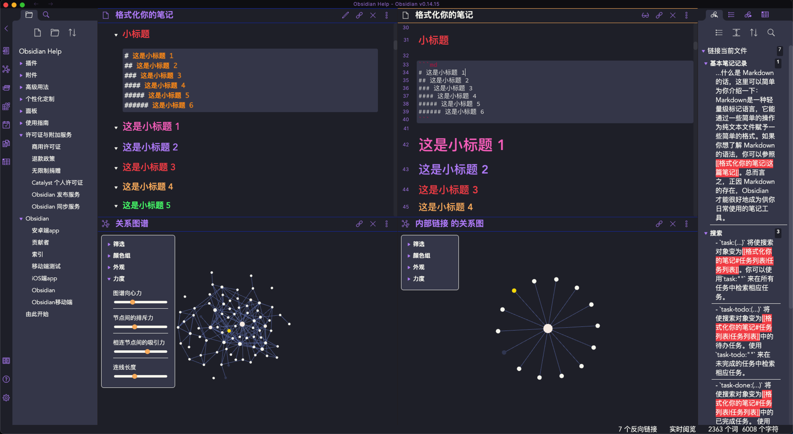

# Dracula for [Obsidian.md](https://obsidian.md)

> A dark theme for [Obsidian](https://obisidian.md), compatible to Obsidian V0.11.00

## Install
This theme has been selected as one of the built-in community themes for Obsidian, you can find the newest version in Settings -> Plugins -> Community Themes and apply the theme by simply clicking the "Use" button.

If you prefer to manually install it, please follow the steps below:

1. Download the obsidian.css file.

2. In Obsidian click Settings->Plugins and turn on "Custom CSS".

3. Put the "obsidian.css" in your vault root folder.

4. Restart Obsidian.

## Creator

This theme is created and maintained by jarodise. 
[Twitter](https://twitter.com/jarodise) / [Instagram](https://www.instagram.com/jarodise)

*The CSS modification of the newest version is based on ["Pisum" by MooddooM](https://github.com/GuangluWu/obsidian-pisum)

## License

[MIT License](./LICENSE)

# 修改
这个是在原作的基础之上做了一些修改，基本上就是一些细节调整，例如更显著的标题栏，右侧工具栏不能隐藏了，同时对内容编辑区域做了一些细节的调整，其他的跟原来的区别不大。
by dwSun
